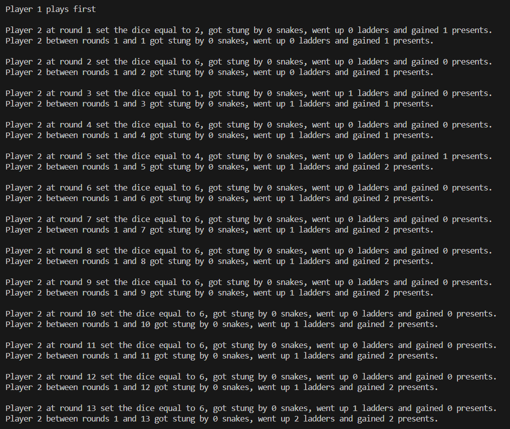
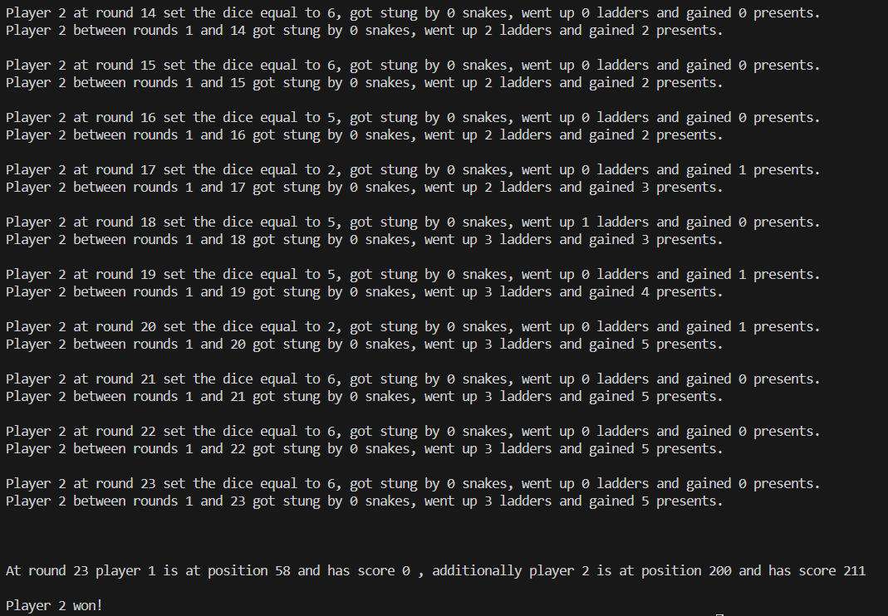

# Snakes-and-Ladders
A Java program that generates a board and plays the well-known game of snakes and ladders.

## Boards
At first, the program prints 3 different tables. The first one includes only the snakes in the game, the second one the ladders and the third one the presents. 

  

 
And here they are all in one board!

  

## Game
After creating the board, the actual game begins. Players roll the dice, and the player with the highest roll starts. A detailed description of each round is provided at the output of the program, end eventually we have an outcome. I should mention that the second player is a "smart" player, he evaluates his moves and every time he choose the most efficient one. So probably he will always be the winner!
 

  
  

