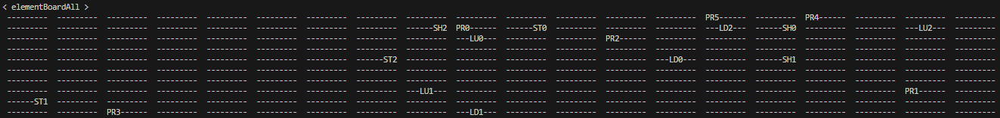

# Snakes-and-Ladders
A Java program that generates a board and plays the well-known game of snakes and ladders.

## Boards
At first, the program prints 3 different tables. The first one includes only the snakes in the game, the second one the ladders and the third the presents. 

  

 
And here they are all in one board!

  

